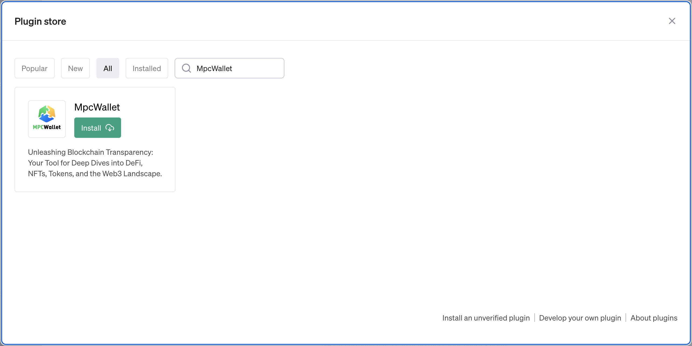
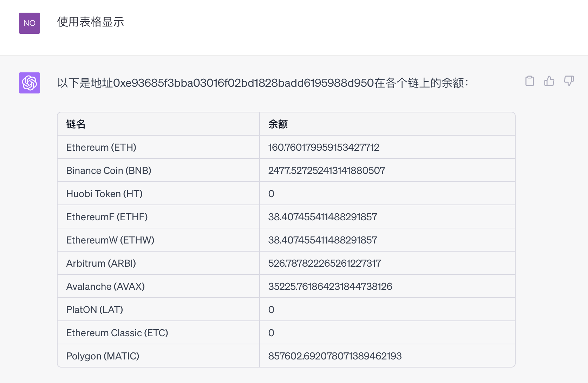

[简体中文](docs/REMADE_CN.md)
# Summary

MpcWalletPlugin is a powerful blockchain plugin that provides a range of functionalities for users to explore DeFi (Decentralized Finance), NFTs (Non-Fungible Tokens), tokens, and the Web3 space in-depth.

# Main Features

1. **Query Address Balance:** Users can check the balance of any public address on various chains. This includes tokens such as ETH, BNB, HT, MATIC, ARBITRUM, AVAX, LAT, ETC, ETHF, ETHW, and more.
2. **Query Layer0 User Information:** Users can query the top N Layer0 users' information, including transaction counts and amounts.

# Installation

## 1. Install the Plugin



Search for "MpcWallet" in Gpt4's Plugin store and click the "Install" button to install it.

## 2. Select the Plugin


In Gpt4's chat window, open the list of installed plugins, select MpcWallet, and you can then use the MpcWallet plugin in the current chat. If you don't want to use it, you can uncheck the MpcWallet checkbox.

# Usage

## 1. Query Address Balance

In the chat window, input the prompt

```tex
query the balance of 0xe93685f3bba03016f02bd1828badd6195988d950
```


You can adjust the output format.



**The following prompts can also trigger the function to query address balance:**

1. 查询0xe93685f3bba03016f02bd1828badd6195988d950余额
2. 0xe93685f3bba03016f02bd1828badd6195988d950

## 2. Query Top N Layer0 User Information

In the chat window, input the prompt

```tex
query top5 users for layer0
```


**Note:**

1. Using "查询排名前5的Layer0用户信息" can also trigger the plugin.
2. N is a variable and can be any integer, such as 1, 5, 10, 20, etc. Smaller values of N generally result in faster queries.
3. When N is large, you can prompt gpt not to use pagination to avoid potential display issues.
4. Due to the use of tables for display, scrolling might not be convenient for viewing results. You can prompt gpt not to use table display.

