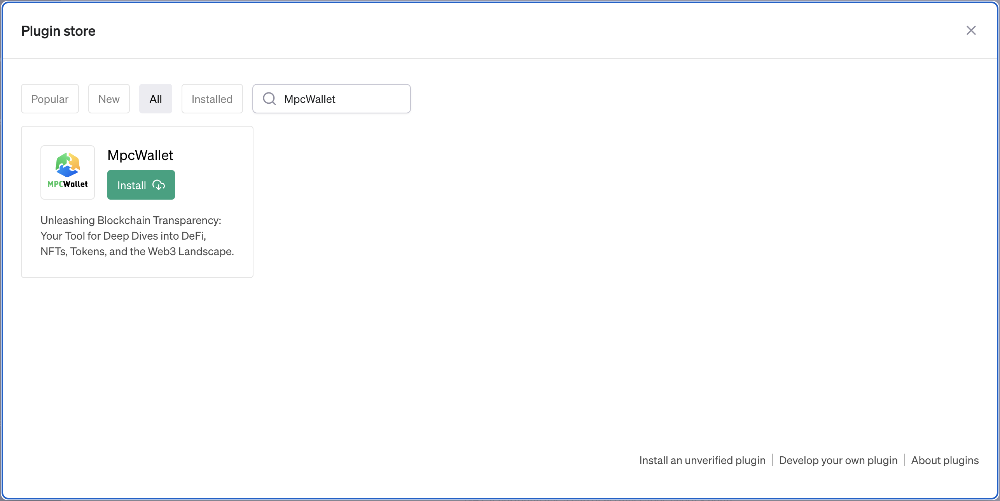
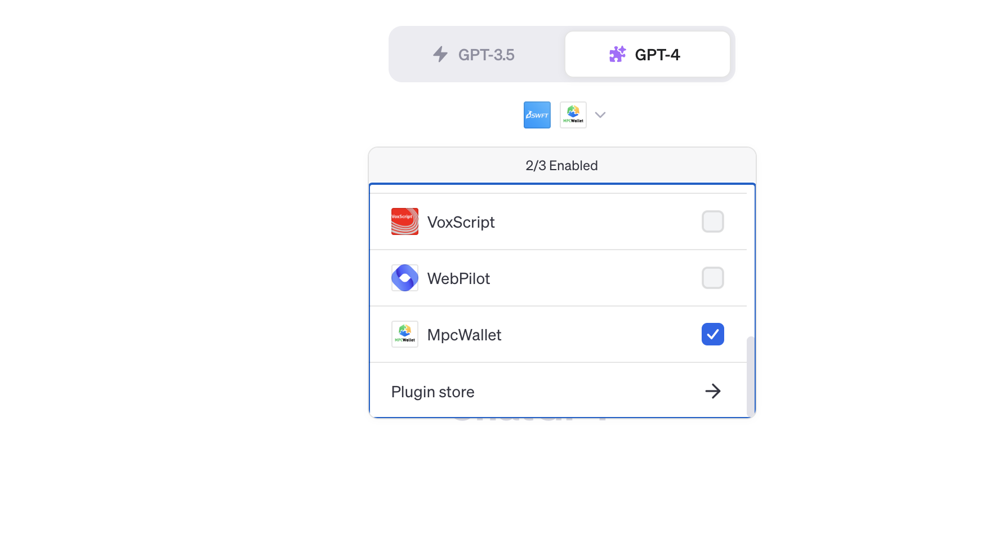
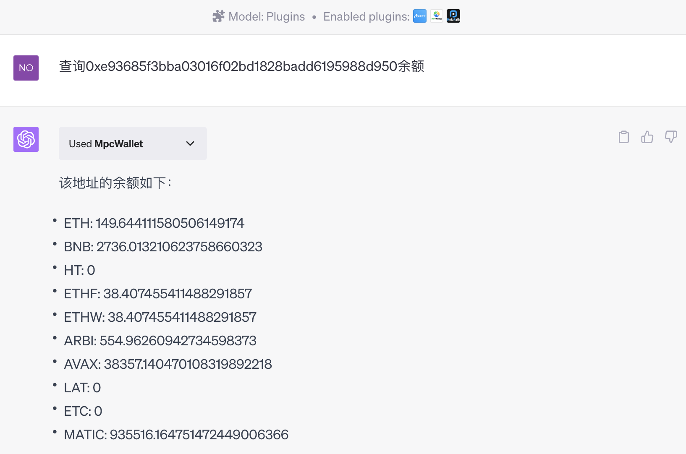
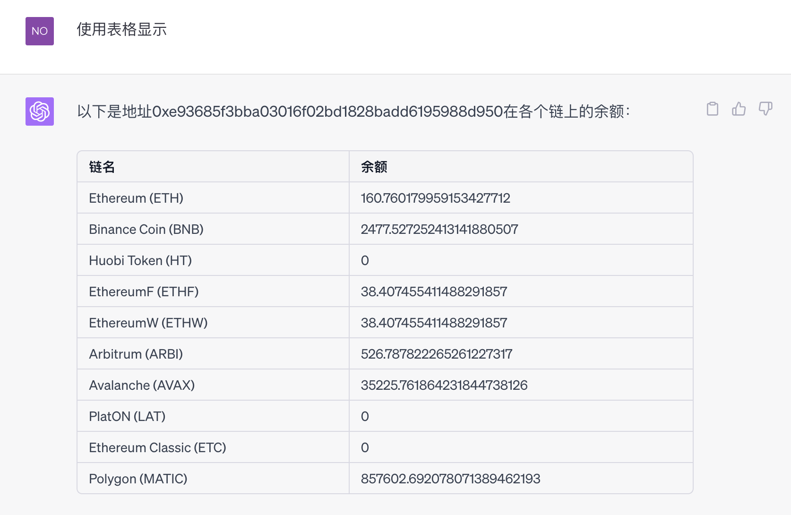
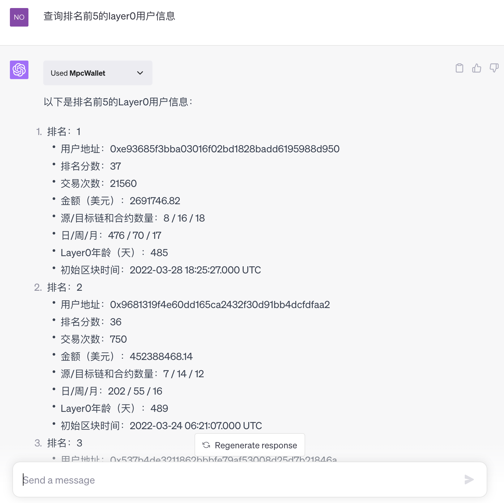

[ENGLISH](../README.md)
# 概要

MpcWalletPlugin是一个强大的区块链插件，它提供了一系列的功能，使得用户能够更深入地探索DeFi（去中心化金融）、NFT（非同质化代币）、代币以及Web3领域。

# 主要功能

1. **查询地址余额：** 用户可以查询任何公开地址在各链上的余额。主要包括ETH、BNB、HT、MATIC、ARBITRUM、AVAX、LAT、ETC、ETHF、ETHW等代币。
2. **查询Layer0用户信息：** 用户可以查询Top N Layer0的用户信息，包括交易数量、交易金额等。

# 安装

## 1.安装插件



在Gpt4的Plugin store中搜索MpcWallet，然后点击Install按钮进行安装。

## 2.选中插件



在Gpt4的聊天窗口中，打开已经安装的插件列表，选中MpcWallet，就可以在当前的聊天中使用MpcWallet插件。如果不想使用，可以把MpcWallet的选择框取消选中。

# 使用

## 1.查询地址余额

在聊天窗口中输入Prompt

```tex
查询0xe93685f3bba03016f02bd1828badd6195988d950余额
```



可以调整输出格式



**输入以下提示词也会触发查询地址余额的功能：**

1. 0xe93685f3bba03016f02bd1828badd6195988d950

## 2.查询Top N Layer0用户信息

在聊天窗口中输入prompt

```tex
query top5 users for layer0
```



**注意：**

1. N是个变量，可以是1、5、10、20等等整数，数值越小，查询速度相对越快
2. 当N很大的时候，可以提示gpt不使用分页，否则可能会出现结果显示混乱的问题